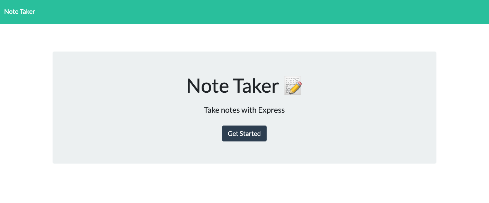
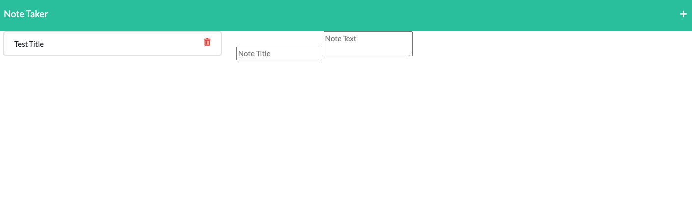

# Note-Takerx3000
The focus of this project was to modify starter code to creat an app that takes notes and saves notes using an Express.js back end to retrieve the data from a JSON file. 

# Technology Used
The technology used was VS Code, Node.js, Express, Github, and Heroku, as well as several NPM packages. 

# Screenshots

# Links to deployed app
[Deployed App](https://note-taker-appx3000.herokuapp.com/notes)

